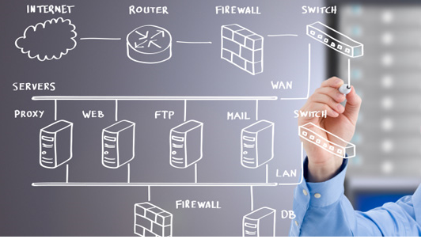
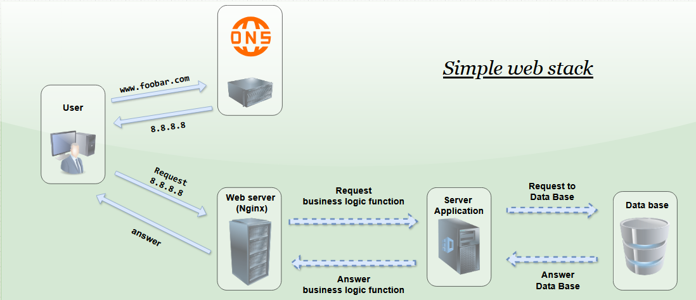
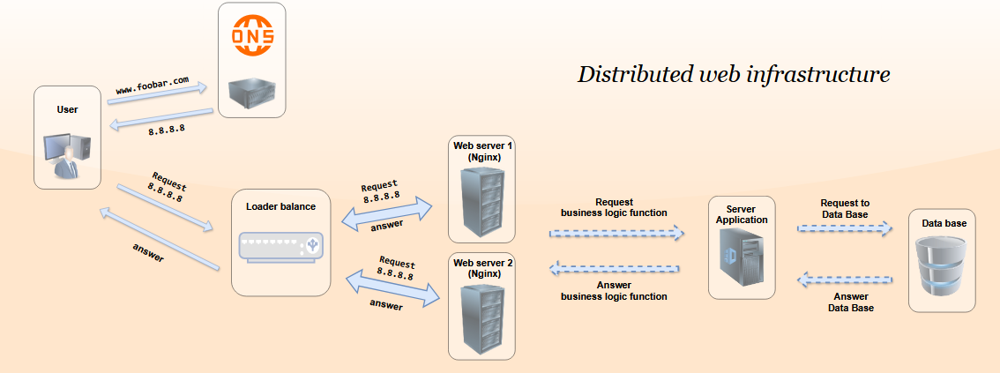
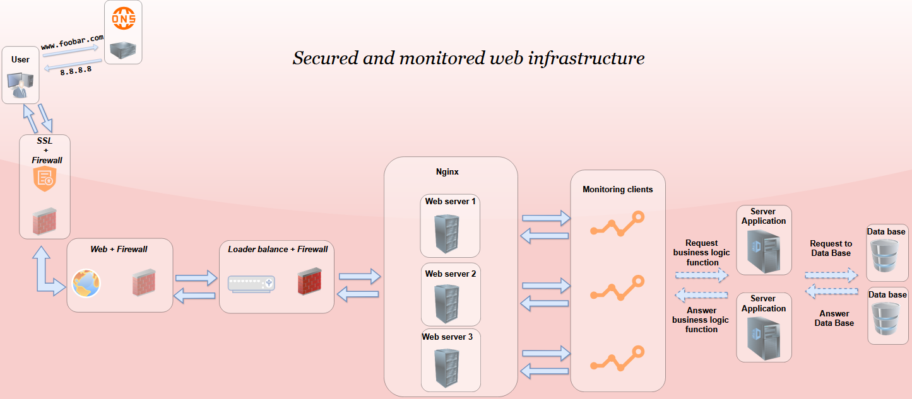
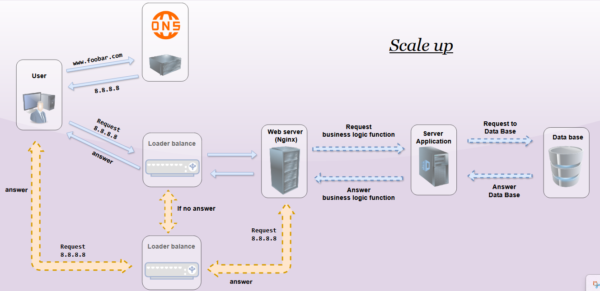

#  Web infrastructure design

## Introduction :
Design a minimal web infrastructure that allows a user to access a site like www.foobar.com BUT, a single point of failure (SPOF), downtime during maintenance, and no ability to scale. Let's move on to separate components and load balancing and, above all, a secure and monitored infrastructure.

## Infrastructure :

1. *__Simple web stack__*
" A simple web is suitable for small projects or test environments. "

2. *__Distributed web infrastructure__*
" A distributed web infrastructure distributes roles across multiple servers to improve reliability and performance. "

3. *__Secured and monitored web infrastructure__*
 " A secure and monitored web infrastructure protects data and ensures service availability "

4. *__Scale up__*
" Ensure continuous availability by intelligently distributing traffic and doubling redundancy points to avoid any interruptions. "

## 1) Simple web stack

1. The user wants to access a website, for example, www.foobar.com.
2. DNS resolves the domain name (like www.foobar.com) to an IP address (e.g. 8.8.8.8)
3. Nginx acts as the web server that handles the user's request.
4. The application server is responsible for executing the business logic.
5. The database stores all the information needed by the application

## 2) Distributed web infrastructure
 DNS resolves the domain name and redirects the request to a load balancer. The load balancer distributes the load among multiple web servers. The web servers, in turn, process the requests and send them to the application servers for business logic. (Too much traffic)

1. IDEM
2. IDEM
3. The Load Balancer receives the request and redirects it to one of the available servers in a web server cluster.
4. IDEM
5. IDEM
6. IDEM

## 3) Secured and monitored web infrastructure

1. SSL Certificate: Traffic is encrypted using an SSL certificate
2. 1st Firewall :  It blocks all unauthorized access and protects the network against attacks
3. 2nd firwall : Restricts access to sensitive internal resources.
4. 3rd firwall :  Ensures that only authorized requests are forwarded from web servers to application servers.

## 4) Scale up

1. The user wants to access a website, for example, www.foobar.com.
2. DNS resolves the domain name (like www.foobar.com) to an IP address (like 8.8.8.8).
3. The Load Balancer receives the request and redirects it to the servers (Nginx).
4. In __cluster mode__ , if one load balancer fails, the second one automatically takes over.
5. Nginx acts as the web server that handles the user's request.
6. The application server is responsible for executing the business logic.
7. The database stores all the information needed by the application.

Added a load balancer to redirect traffic if the first one fails.

## Conclusion : 

For an efficient web infrastructure, it is crucial to have a good balance between security, availability, performance, scalability and monitoring.
